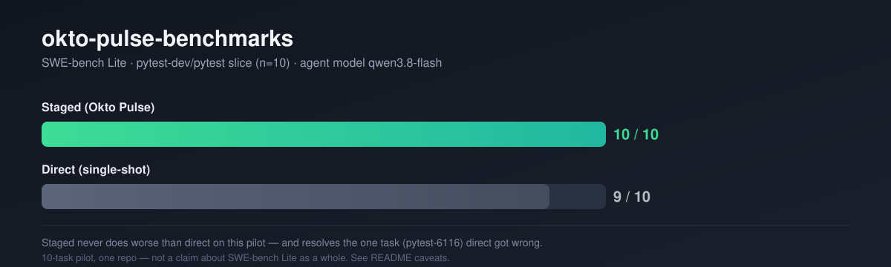

# okto-pulse-benchmarks

<p align="center">
  
</p>

**Does Okto Pulse's staged, plan-then-edit workflow actually produce better
patches than a single-shot direct edit?** This repo answers that with paired
runs of [SWE-bench Lite](https://huggingface.co/datasets/SWE-bench/SWE-bench_Lite)
against a direct-edit baseline, graded by the official `swebench` harness
(`FAIL_TO_PASS` / `PASS_TO_PASS`, nothing judged by an LLM).

**Short answer: promising, not proven yet.** On a 10-task pilot with
`qwen3.8-flash`, staged matched direct on 9 tasks and resolved the one
direct missed, closing 9/10 → **10/10**. Read the caveats before quoting
that number — this is a pilot on 10 tasks from **one** of Lite's twelve
repos, not the full 300-task set, and at this sample size the result does
not clear statistical significance.

## Results

### The one number

Tasks resolved out of 10, `qwen3.8-flash`, on the `pytest-dev/pytest` slice
of SWE-bench Lite. Higher is better.

| Arm | Resolved |
|:--|:--:|
| **Staged (Okto Pulse)** | **10 / 10** |
| Direct (single-shot) | 9 / 10 |
| **Staged advantage** | +1 |

**Staged closed the one gap direct had left.** The only instance direct
missed, `pytest-dev__pytest-6116` (an `ambiguous_failure` with reason
`missing_module`), staged resolved.

### How to read this

New here? Three sentences of context.

- Every comparison is **paired**: staged and direct run the same 10 task
  instances, so a gap (or lack of one) isn't explained by one arm getting
  easier work.
- **Resolved** means the harness applied the model's patch to the repo at the
  issue commit and every `FAIL_TO_PASS` test now passes while every
  `PASS_TO_PASS` test still passes. Nothing here is graded by an LLM.
- At n=10, a raw count is a lead, not a finding. This repo does not claim
  significance — see Caveats.

### Per-instance breakdown

All 10 instances, with the actual GitHub issue title, patch size, and the
`FAIL_TO_PASS` test count the harness graded each patch against. `F2P` is
tests-passing / tests-total for that instance's `FAIL_TO_PASS` set; every
instance in both arms kept 100% of `PASS_TO_PASS` (no regressions anywhere,
in either arm).

| Instance | Issue | Direct | Staged | F2P (direct) | F2P (staged) | Patch size (direct → staged) |
|---|---|:--:|:--:|:--:|:--:|:--|
| pytest-5221 | Display fixture scope with `pytest --fixtures` | ✅ | ✅ | 2/2 | 2/2 | 1 file / 28 lines → 1 file / 28 lines |
| pytest-5227 | Improve default logging format | ✅ | ✅ | 3/3 | 3/3 | 2 files / 25 lines → 2 files / 25 lines |
| pytest-5413 | `str()` on the `pytest.raises` context variable doesn't match a normal `except` | ✅ | ✅ | 1/1 | 1/1 | 1 file / 18 lines → 1 file / 18 lines |
| pytest-5495 | Confusing assertion-rewrite message for byte strings | ✅ | ✅ | 2/2 | 2/2 | 2 files / 68 lines → 2 files / 68 lines |
| pytest-5692 | Hostname and timestamp in generated JUnit XML | ✅ | ✅ | 2/2 | 2/2 | 2 files / 32 lines → 2 files / 32 lines |
| **pytest-6116** | `--collect-only` needs a one-char shortcut | ❌ | ✅ | **0/2** | **2/2** | 1 file / 18 lines → **2 files / 19 lines** |
| pytest-7220 | Wrong path to test file when a fixture changes directory | ✅ | ✅ | 1/1 | 1/1 | 2 files / 37 lines → 2 files / 37 lines |
| pytest-7373 | Incorrect caching of skipif/xfail string condition evaluation | ✅ | ✅ | 1/1 | 1/1 | 2 files / 65 lines → 2 files / 64 lines |
| pytest-7432 | `--runxfail` breaks skip-location reporting | ✅ | ✅ | 1/1 | 1/1 | 2 files / 21 lines → 2 files / 21 lines |
| pytest-8365 | `tmpdir` creation fails for usernames with illegal directory characters | ✅ | ✅ | 1/1 | 1/1 | 2 files / 25 lines → 2 files / 25 lines |

On the 9 instances both arms resolved, direct and staged landed on
**near-identical patches** — same file count, same or almost-same line
count. Staging isn't rewriting working solutions into different working
solutions here; it's only changing the outcome on the one instance where
direct's approach was actually wrong.

<details>
<summary><b>Worked example: why staging fixed pytest-6116</b></summary>

The issue asks for `--co` as a shortcut for `--collect-only`. Both models
found the right file; they diverged on *how* to wire the shortcut in.

**Direct's patch** — rewrites `-co` to `--collect-only` in the raw arg list
before pytest's argparse-based option parser ever sees it:

```diff
--- a/src/_pytest/config/__init__.py
+++ b/src/_pytest/config/__init__.py
@@ -211,6 +211,13 @@ def _prepareconfig(args=None, plugins=None):
+    # Expand the ``-co`` shortcut for ``--collect-only`` up-front...
+    args = ["--collect-only" if arg == "-co" else arg for arg in args]
     config = get_config(args, plugins)
```

This makes `pytest -co` work, but `--co` never becomes a real registered
option — it doesn't show up in `--help`, isn't recognized as `--co` by
anything that inspects the parser, and the issue actually asked for `--co`
(long form), not `-co`. Both `FAIL_TO_PASS` tests failed.

**Staged's patch** — registers `--co` as a real alias on the existing
`addoption` call, the same place `--collectonly`/`--collect-only` are
already registered:

```diff
--- a/src/_pytest/main.py
+++ b/src/_pytest/main.py
@@ -109,6 +109,7 @@ def pytest_addoption(parser):
     group.addoption(
         "--collectonly",
         "--collect-only",
+        "--co",
         action="store_true",
```

...plus a changelog entry (`changelog/6116.improvement.rst`), which is the
project's actual contribution convention. Both `FAIL_TO_PASS` tests passed.

The gap here isn't model capability — it's that staging's plan-then-edit
lifecycle (spec derivation, FR/TR/AC fill-in, review before implementation)
pointed the model at "add a real option" rather than "patch the arg list,"
which is the difference between a workaround and the actual fix the
maintainers took.

Full diffs: `results/examples/pytest-6116-direct.diff`,
`results/examples/pytest-6116-staged.diff`.

</details>

### Caveats, read before quoting any number

**This is a 10-task pilot on one repo, not the 300-task Lite set.** All ten
instances are from `pytest-dev/pytest`; none of the other eleven repos in
Lite (Django, Flask, scikit-learn, sympy, matplotlib, requests, astropy,
sphinx, xarray, pylint, …) have been run yet. Nothing here should be read as
a Lite-wide number.

**No significance test is reported, on purpose.** At n=10 with a paired
binary outcome, the best-case shape for this sample size is a single
discordant pair — exactly what happened here — and even that does not clear
conventional significance thresholds under an exact McNemar test. Reporting
a p-value would imply a precision the sample doesn't support. Treat the
+1 above as directional.

**Gold-patch sanity check passed.** Before trusting either run, the actual
upstream fix for all 10 instances was applied and evaluated through the same
harness: `results/gold.validate-gold-all-10.json` shows 10/10 resolved, 0
unresolved, 0 errors. The harness and container setup are not the source of
any observed failure.

**Staged needed a retry on one task** (`task-4`, see
`qwen-staged/task-4-rerun` in the raw run tree) before it resolved — the
10/10 is real per the harness, but wasn't first-attempt-clean throughout.

### Other runs

**Qwen3.5-9B — code-change completion, n=10.** A second pilot on the same
`pytest-dev/pytest` slice, this time with `Qwen3.5-9B` as the agent model.
This run only measures whether each arm produced a code change at all — it
was **not** graded through the `swebench` harness, so there is no
resolved/unresolved figure and it is not comparable to the `qwen3.8-flash`
numbers above. Both Direct and Staged produced a patch for all 10/10 tasks;
Staged reached every pipeline stage up to Validation (0/10) on all 10 tasks;
only 2 of 10 Direct patches were compile-verified, and none of Staged's were.
Full writeup, including why no resolved rate is reported:
[`reports/2026-09-23-qwen3.5-9b-pytest-pilot.md`](reports/2026-09-23-qwen3.5-9b-pytest-pilot.md).

## Setup

```bash
pip install swebench
# qwen3.8-flash runs go through whatever OpenAI-compatible endpoint you route it to
```

Docker is required — `swebench` builds and runs a per-instance container to
apply the patch and execute `FAIL_TO_PASS` / `PASS_TO_PASS`.

## Running

**Direct** patches are produced by prompting the model once with the issue
text and repo checkout and taking its diff as-is.

**Staged** patches are produced by driving the same task through Okto
Pulse's full lifecycle before any code is written — ideation → architecture +
mockup → review/approve → spec derivation → FR/TR/AC fill-in → review/approve
→ implementation card — then applying the resulting edit. See
`runners/staged_driver.py` (drives the lifecycle over Pulse's REST API,
since the MCP bridge stringifies array params that some gates require as
real arrays) and `runners/apply_staged.py` (turns the approved staged edit
into a real `git diff`, identical in mechanism to how the direct arm's diff
is produced — the variable under test is the process, not the edit
mechanics).

```bash
# grade a predictions file with the official harness
python -m swebench.harness.run_evaluation \
  --dataset_name SWE-bench/SWE-bench_Lite \
  --predictions_path results/predictions_staged.jsonl \
  --run_id staged \
  --max_workers 4

python -m swebench.harness.run_evaluation \
  --dataset_name SWE-bench/SWE-bench_Lite \
  --predictions_path results/predictions_direct.jsonl \
  --run_id direct \
  --max_workers 4
```

Each run writes a `<run_id>.json` summary (the files under `results/` were
produced this way) plus a `logs/run_evaluation/<run_id>/` tree with
per-instance container logs.

## Methodology

A raw resolved-count delta is not, on its own, treated as evidence of
anything beyond "worth a bigger run":

- staged and direct run the **same instances**, so a gap isn't explained by
  one arm getting easier tasks;
- grading is entirely mechanical — the harness's `FAIL_TO_PASS`/`PASS_TO_PASS`
  test execution decides resolved or not, nothing is judged by an LLM;
- the result was checked against the **gold-patch sanity run**
  (`results/gold.validate-gold-all-10.json`) so a harness/container problem
  can't be mistaken for an editing-quality result;
- no significance claim is made below the sample size that would support one
  — see Caveats.

## Next steps, in priority order

1. **Scale past 10 instances, and past one repo.** The current pilot can't
   distinguish "staging helps" from "staging happened to help on this
   slice." Widening to more of Lite's 300 tasks and its other 11 repos is
   the only way to get a number worth quoting externally.
2. **Add a paired significance test** (bootstrap CI / exact McNemar) once the
   sample is large enough for it to be meaningful.
3. **Run additional agent models** on the same instance set to see whether
   the staged advantage holds beyond `qwen3.8-flash`.

## Repo layout

```
results/    per-run harness summaries (*.json), raw predictions (*.jsonl),
            the gold-patch sanity check, and examples/ (worked-example
            direct-vs-staged diffs cited in the README/reports)
runners/    Okto Pulse staged-lifecycle driver (staged_driver.py), the REST
            helper it runs over (pulse_rest.py), and the diff-emission step
            shared by both arms (apply_staged.py)
scripts/    per-task problem statements / spec fields fed into the staged
            lifecycle (gen_staged.py)
suites/     benchmark definition and how to reproduce a run
reports/    dated write-ups with full numbers and caveats
```
